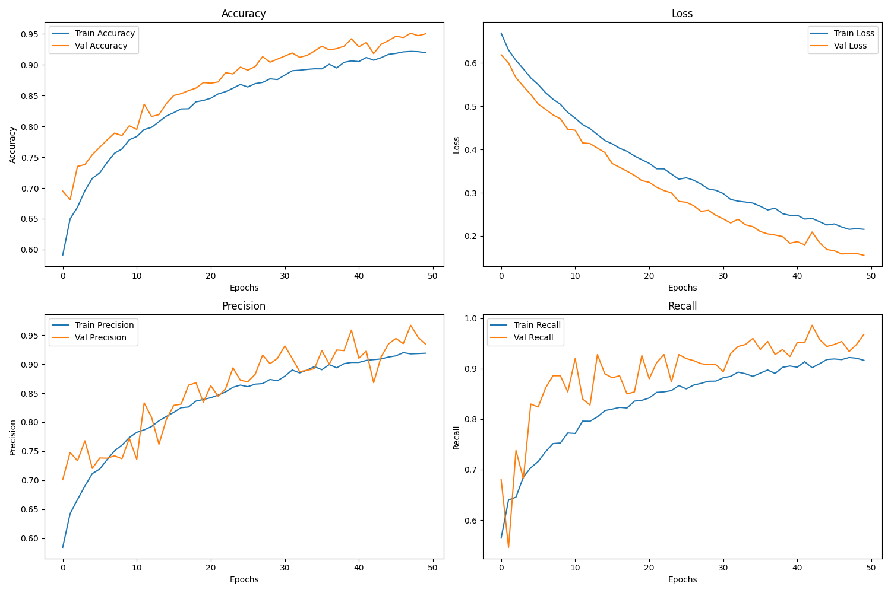

# Ocular-Diagnostics-for-Anemia
This AI-driven project utilizes deep learning (EfficientNetB0) for non-invasive anemia detection from conjunctival images. It offers a rapid, accessible screening tool, providing a promising alternative to traditional blood tests through a complete model development and export pipeline.
## Features

- **EfficientNetB0 Backbone:** Utilizes a state-of-the-art convolutional neural network for robust feature extraction and classification.
- **Transfer Learning:** Leverages pre-trained ImageNet weights for improved accuracy and faster convergence.
- **Data Augmentation:** Applies real-time image augmentation (rotation, shift, shear, zoom, flip) to improve model generalization.
- **Early Stopping & Learning Rate Scheduling:** Integrates callbacks to prevent overfitting and optimize training.
- **Comprehensive Metrics:** Tracks accuracy, precision, recall, and AUC during training and evaluation.
- **Export Options:** Supports model export to Keras H5 and TensorFlow.js formats for deployment in web or mobile environments.
- **Training History Visualization:** Generates and saves plots of training/validation accuracy and loss for performance analysis.
- **Configurable Parameters:** Easily adjust image size, batch size, epochs, and data directories.

## Setup

1. **Clone the repository:**
   ```bash
   git clone https://github.com/ankith2104/Ocular-Diagnostics-for-Anemia.git
   cd Ocular-Diagnostics-for-Anemia
   ```

2. **Install dependencies:**
   ```bash
   pip install tensorflow tensorflowjs matplotlib
   ```

3. **Prepare your dataset:**
   - Organize images in `train/`, `val/`, and `test/` directories with subfolders for each class.

## Usage

Edit `main.py` to set your data directories, then run:

```bash
python main.py
```
## Training History

Below is the plot of the training and validation accuracy/loss over 50 epochs:


