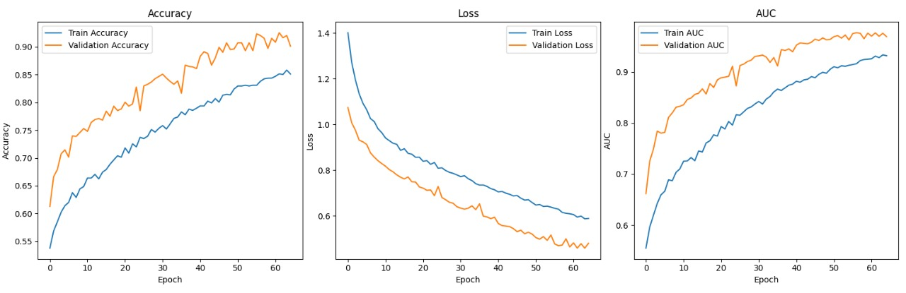
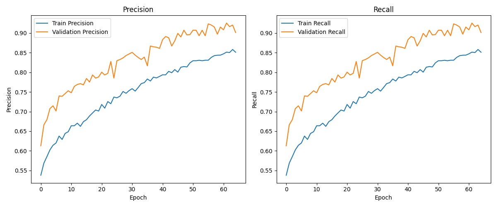

# Ocular-Diagnostics-for-Anemia

## Overview

Ocular-Diagnostics-for-Anemia is a deep learning-based medical diagnostic tool that uses conjunctival images to detect anemia. The project leverages transfer learning with MobileNetV2 to analyze ocular conjunctiva images and classify them as anemic or non-anemic, providing a non-invasive screening method for anemia detection.

## Features

- **Non-invasive Detection**: Uses conjunctival images for anemia screening
- **Transfer Learning**: Leverages pre-trained MobileNetV2 for efficient training
- **Two-Phase Training**: Initial feature extraction followed by fine-tuning
- **Data Augmentation**: Comprehensive augmentation for improved generalization
- **Class Imbalance Handling**: Computed class weights for balanced training
- **Multiple Metrics**: Tracks accuracy, AUC, precision, and recall
- **TensorFlow Lite Support**: Optimized model for mobile deployment
- **Comprehensive Monitoring**: Early stopping, learning rate reduction, and model checkpointing

## Dataset

The project uses a conjunctival image dataset organized in the following structure:

```
Conjuctiva/
├── Training/
│   ├── Anemic/
│   └── Non-Anemic/
├── Validation/
│   ├── Anemic/
│   └── Non-Anemic/
└── Testing/
    ├── Anemic/
    └── Non-Anemic/
```

**Data Preprocessing:**
- Images resized to 224×224 pixels
- MobileNetV2 preprocessing applied
- Data augmentation including rotation, shifts, shear, zoom, and flips

## Model Architecture

The model is built using transfer learning with the following architecture:

1. **Base Model**: MobileNetV2 (pre-trained on ImageNet)
2. **Custom Top Layers**:
   - Global Average Pooling 2D
   - Batch Normalization
   - Dense layer (256 units, ReLU activation, L2 regularization)
   - Dropout (50% rate)
   - Output layer (2 units, Softmax activation)

### Training Strategy

**Phase 1: Feature Extraction**
- Freeze base model layers
- Train only custom top layers
- Higher learning rate (10× base rate)
- 15 epochs

**Phase 2: Fine-tuning**
- Unfreeze last 20 layers of base model
- Lower learning rate for fine-tuning
- Up to 50 epochs with early stopping

## Installation

### Prerequisites

- Python 3.7+
- CUDA-compatible GPU (recommended)

### Dependencies

```bash
pip install tensorflow>=2.8.0
pip install numpy
pip install matplotlib
pip install scikit-learn
pip install Pillow
```

### Clone Repository

```bash
git clone https://github.com/ankith2104/Ocular-Diagnostics-for-Anemia.git
cd Ocular-Diagnostics-for-Anemia
```

## Usage

### Training the Model

1. **Prepare Dataset**: Organize your conjunctival images in the required directory structure
2. **Update Configuration**: Modify the `CONFIG` dictionary in `main.py` with your dataset path

```python
CONFIG = {
    "data_dir": "path/to/your/dataset",
    "input_shape": (224, 224, 3),
    "batch_size": 32,
    "learning_rate": 0.00001,
    "epochs": 50,
    "patience": 10,
    "fine_tune_at": -20,
    "dropout_rate": 0.5,
    "l2_reg": 0.001,
    "tflite_save_path": "anemia_detection.tflite"
}
```
3. **Run Training**:

```bash
python main.py
```

### Model Outputs

After training, the following files are generated:
- `best_model.h5`: Best model based on validation accuracy
- `final_model.h5`: Final trained model
- `anemia_detection.tflite`: TensorFlow Lite model for mobile deployment
- `training_history.jpg`: Training accuracy, loss and auc visualization
- `training_history_precision_recall.jpg`: Training precision and recall visualization

## Training Results

### Training Configuration

| Parameter | Value |
|-----------|--------|
| Input Shape | 224×224×3 |
| Batch Size | 32 |
| Learning Rate | 0.00001 |
| Max Epochs | 50 |
| Patience | 10 |
| Dropout Rate | 0.5 |
| L2 Regularization | 0.001 |

### Data Augmentation Settings

| Augmentation | Value |
|--------------|--------|
| Rotation Range | 30° |
| Width/Height Shift | 25% |
| Shear Range | 25% |
| Zoom Range | 25% |
| Horizontal Flip | True |
| Vertical Flip | True |

### Training Metrics Graphs

#### Accuracy, Loss and AUC


#### Precision and Recall


## Model Performance

### Test Set Results                                   

| Metric | Score |
|--------|-------|
| **Test Accuracy** | 92.90% |
| **Test AUC** | 0.9783 |
| **Test Precision** | 0.9290 |
| **Test Recall** | 0.9290 |                       

### Class Distribution

| Class | Training Samples | Validation Samples | Test Samples |
|-------|------------------|-------------------|--------------|
| Anemic | 4219 | 500 | 500 |
| Non-Anemic | 4037 | 500 | 500 |

## Medical Disclaimer

This tool is intended for research and educational purposes only. It is not intended be used as a substitute for professional medical diagnosis or treatment.

## License

This project is licensed under the MIT License - see the [LICENSE](LICENSE) file for details.